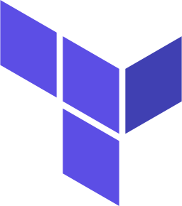

## Hi, I'm Mateusz, I'm a junior MLOps engineer and CS student 👋🦾

### Languages:

 **python** &nbsp;&nbsp;&nbsp;
 **bash** &nbsp;&nbsp;&nbsp;
 **powershell**

### Clouds:

 **Azure** &nbsp;&nbsp;&nbsp;
 **Google**

### Tools:

 **terraform** &nbsp;&nbsp;&nbsp;
 **docker** &nbsp;&nbsp;&nbsp;
 **git**
